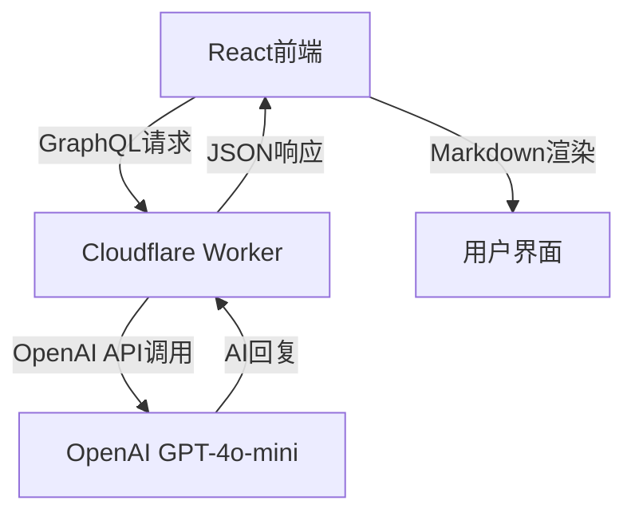

# 🤖 AI Chat Molly - 项目总结

## 📋 项目概述

AI Chat Molly 是一个现代化的AI聊天应用，具备完整的前后端架构，支持富文本渲染和流畅的用户体验。

### 🏗️ 技术架构



## 🎯 核心功能

### ✅ 已实现功能

1. **AI聊天对话**
   - 支持与GPT-4o-mini模型的实时对话
   - 流畅的消息发送和接收体验
   - 连接状态指示器

2. **富文本渲染**
   - ✅ Markdown语法支持（标题、列表、链接等）
   - ✅ 数学公式渲染（LaTeX语法，使用KaTeX）
   - ✅ 代码语法高亮（支持多种编程语言）
   - ✅ 表格、引用块等GitHub风格Markdown

3. **用户界面**
   - 现代化的聊天界面设计
   - 响应式布局，适配各种屏幕尺寸
   - 实时的输入状态指示
   - 自动滚动到最新消息

4. **后端服务**
   - Cloudflare Worker作为中间层
   - GraphQL API接口
   - CORS跨域支持
   - 错误处理和日志记录

## 🛠️ 技术栈

### 前端技术
- **React 18** - 用户界面框架
- **TypeScript** - 类型安全的JavaScript
- **Tailwind CSS** - 实用优先的CSS框架
- **Vite** - 现代化的构建工具
- **React Markdown** - Markdown渲染
- **KaTeX** - 数学公式渲染
- **Highlight.js** - 代码语法高亮

### 后端技术
- **Cloudflare Workers** - 边缘计算平台
- **GraphQL** - API查询语言
- **OpenAI API** - AI模型服务（GPT-4o-mini）

## 📁 项目结构

### 前端结构 (`ai-chat-molly/`)
```
src/
├── components/           # 可复用的UI组件
│   ├── ChatContainer.tsx    # 主聊天容器组件
│   ├── MessageList.tsx      # 消息列表组件
│   ├── MessageInput.tsx     # 消息输入组件
│   └── MarkdownMessage.tsx  # Markdown渲染组件
├── services/            # API服务层
│   └── api.ts              # 与后端通信的API类
├── types/               # TypeScript类型定义
│   └── chat.ts             # 聊天相关类型
├── App.tsx              # 根组件
├── main.tsx             # 应用入口点
└── index.css            # 全局样式和Markdown样式
```

### 后端结构 (`openai-graphql-worker/`)
```
src/
└── index.js             # Worker主文件，处理GraphQL请求
wrangler.toml           # Cloudflare Worker配置
package.json            # 项目依赖和脚本
```

## 🔧 核心组件详解

### 1. ChatContainer组件
**职责**: 管理整个聊天应用的状态和逻辑
- 消息状态管理
- API调用协调
- 错误处理
- 连接状态监控

### 2. MessageList组件
**职责**: 渲染消息列表
- 区分用户消息和AI消息的样式
- 自动滚动到最新消息
- 支持富文本渲染
- 输入状态动画

### 3. MarkdownMessage组件
**职责**: 渲染AI回复的富文本内容
- 完整的Markdown语法支持
- 数学公式渲染
- 代码语法高亮
- 自定义样式组件

### 4. API服务类
**职责**: 与后端通信
- GraphQL查询构建
- 错误处理和重试逻辑
- 连接状态检测
- 类型安全的响应处理

### 5. Cloudflare Worker
**职责**: 后端API网关
- 接收GraphQL请求
- 调用OpenAI API
- 响应格式转换
- CORS处理

## 🎨 设计特点

### UI/UX设计
1. **简洁现代**: 采用现代化的聊天界面设计
2. **色彩系统**: 蓝色主色调，清晰的层次结构
3. **响应式**: 适配桌面和移动端设备
4. **交互反馈**: 丰富的状态指示和动画效果

### 富文本支持
1. **Markdown渲染**: 支持完整的GitHub风格Markdown
2. **数学公式**: 支持LaTeX语法的数学公式
3. **代码高亮**: 多语言代码语法高亮
4. **表格支持**: 美观的表格渲染

## 🔗 API接口设计

### GraphQL Schema
```graphql
type Query {
  chat(
    messages: [MessageInput!]!
    model: String = "gpt-4o-mini"
    maxTokens: Int = 1024
    temperature: Float = 0.7
  ): ChatResponse
}

type ChatResponse {
  id: String
  model: String
  choices: [Choice!]!
  usage: Usage
  created: Int
}

type Choice {
  message: Message!
  finishReason: String
  index: Int
}

type Message {
  role: String!
  content: String!
}

input MessageInput {
  role: String!
  content: String!
}
```

## 🚀 部署和配置

### 前端部署
```bash
cd ai-chat-molly
npm install
npm run build
npm run preview
```

### 后端部署
```bash
cd openai-graphql-worker
# 设置OpenAI API密钥
wrangler secret put OPENAI_API_KEY
# 部署到Cloudflare
wrangler deploy
```

## 🔒 安全考虑

1. **API密钥保护**: OpenAI API密钥存储在Cloudflare Worker环境变量中
2. **CORS配置**: 适当的跨域资源共享设置
3. **输入验证**: 前后端都有输入验证机制
4. **错误处理**: 完善的错误处理，避免敏感信息泄露

## 📈 性能优化

### 前端优化
- 使用React.memo减少不必要的重渲染
- 懒加载的Markdown渲染组件
- Tailwind CSS的按需加载
- 图标库的Tree Shaking

### 后端优化
- Cloudflare Workers的边缘计算
- GraphQL的精确数据获取
- 适当的错误处理和重试机制

## 🐛 已知问题和限制

1. **流式响应**: 当前不支持真正的流式响应，使用模拟实现
2. **消息历史**: 刷新页面会丢失聊天历史
3. **文件上传**: 暂不支持图片或文件上传功能
4. **用户认证**: 没有用户认证和会话管理

## 🔮 未来改进方向

### 短期目标
1. 添加消息历史持久化（localStorage或数据库）
2. 实现真正的流式响应
3. 添加消息复制、删除功能
4. 优化移动端体验

### 长期目标
1. 用户认证和多用户支持
2. 对话分组和管理
3. 文件和图片上传支持
4. 插件系统和扩展功能
5. 多语言国际化支持

## 📊 项目统计

- **前端组件**: 4个主要组件
- **代码行数**: 约800行TypeScript代码
- **依赖包**: 20+个npm包
- **支持格式**: Markdown、LaTeX、多种编程语言
- **部署平台**: Vercel/Netlify (前端) + Cloudflare Workers (后端)

## 🎉 总结

AI Chat Molly 是一个功能完整、架构清晰的现代AI聊天应用。通过使用最新的技术栈和最佳实践，实现了：

- 🎯 **用户体验**: 流畅的聊天体验和美观的界面
- 🔧 **技术实现**: 现代化的前后端分离架构
- 📝 **富文本支持**: 完整的Markdown和数学公式渲染
- 🚀 **性能优化**: 快速的响应和高效的渲染
- 🔒 **安全可靠**: 适当的安全措施和错误处理

这个项目展示了如何构建一个生产级的AI聊天应用，具备良好的可扩展性和维护性。
